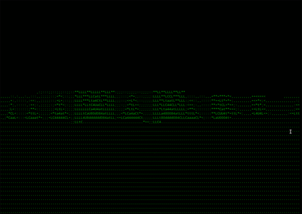

Sprites nearly working!:

Terminal Dungeon

A Doom-like game that renders to ascii and outputs to terminal!

'esc' to exit

't' to turn off textures

IMPORTANT:
Make sure the pygame window is focused for input events to be received.

Depending on your terminal font, Renderer.ascii_map may need to be adjusted.
If you'd like to make an ascii map more suitable to your terminal's font,
check my Snippets repository for a script that grabs mean brightness of
unicode characters.

Values stored in textures should range from 0-9.  Values below 6 are
subtractive and above 6 are additive.

This project wouldn't have been possible without the following valuable
resources:

[Lode's Computer Graphics Tutorial](https://lodev.org/cgtutor/raycasting.html)

[PyRay - Python Raycasting Engine](https://github.com/oscr/PyRay)

[pygame-raycasting-experiment](https://github.com/crobertsbmw/pygame-raycasting-experiment/blob/master/raycast.py)
