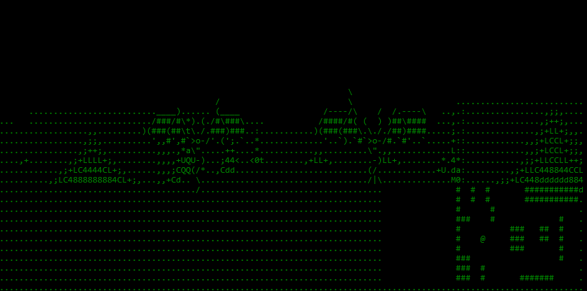

# Terminal Dungeon

`terminal_dungeon` is a raycasting library for your terminal! `pip install terminal_dungeon` to install and `python -m terminal_dungeon` to play.

### Controls
------------
* `wasdqe` or arrow-keys to move
* `t` to toggle textures
* `esc` to exit

### References
--------------
This project wouldn't have been possible without the following valuable resources:

[Lode's Computer Graphics Tutorial](https://lodev.org/cgtutor/raycasting.html)

[PyRay - Python Raycasting Engine](https://github.com/oscr/PyRay)

[pygame-raycasting-experiment](https://github.com/crobertsbmw/pygame-raycasting-experiment/blob/master/raycast.py)
